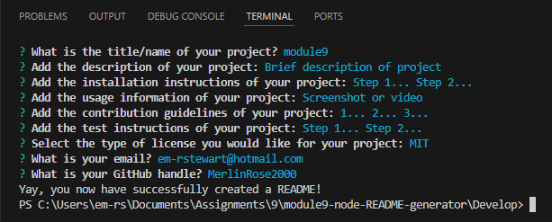

# module9-node-README-generator
  
  ## Table-of-Contents

  [Description](#description)
  [Installation](#installation)
  [Usage](#usage)
  [Tests](#tests)
  [Questions](#questions)
  
  ## [Description](#table-of-contents)

  This README generator will help users create a professional and complete README for their respective projects.

  ## [Installation](#table-of-contents)

  [README video](https://drive.google.com/file/d/1pWSfDf96EnShMrf4VpzsRC-LesV1ji93/view)

  

  ## [Usage](#table-of-contents)

  Run "node index.js" in the terminal after the installation is finished. After responding to the prompts, you should notice your file named "README_sample" in the "Develop" folder, a console log displaying your responses to the prompts, and a message stating "Yay, you now have successfully created a README!"

  ## [Tests](#table-of-contents)

  Open the file in VS Code to test the application. Run "node index.js" in the terminal. View the "README_sample.md" file preview in the "Develop" folder by responding to the prompts.

  ## [Questions](#table-of-contents)

  Please contact me using the following links:

  [em-rstewart@hotmail.com](mailto:em-rstewart@hotmail.com)

  [MerlinRose2000](https://github.com/MerlinRose2000)
